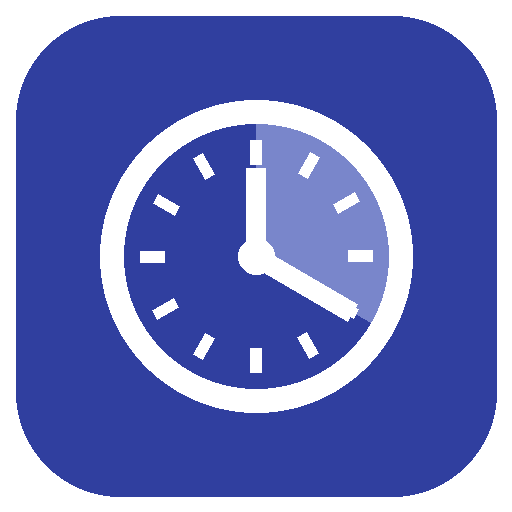

<p align="center">
  
</p>

<h1 align="center">Auto Time Lapse</h1>

<p align="center">
  <a href="https://github.com/hacs/integration"></a>
  <a href="https://github.com/samuelzamvil/Auto-Time-Lapse/releases"></a>
  <a href="https://github.com/samuelzamvil/Auto-Time-Lapse/actions/workflows/validate.yml"></a>
  <a href="https://github.com/samuelzamvil/Auto-Time-Lapse/actions/workflows/test.yml"></a>
  <a href="LICENSE"></a>
  
</p>

<p align="center">
  Turn any Home Assistant camera into a timelapse factory.<br>
  Snapshots on your schedule or your printer's say-so &mdash; stitched into an MP4 by ffmpeg, ready to play in the Media Browser.
</p>

---

## ✨ Highlights

- 📷 **One camera, many timelapses** — add a camera once, then stack independent trigger profiles on it, each with its own interval, frame rate, and output settings.
- 🎛️ **Three trigger modes**, picked from a dropdown:
  - **Manual** — a capture switch plus `start`/`stop` services, drivable from any automation.
  - **Daily time window** — capture between two times every day; overnight windows (22:00 → 06:00) just work.
  - **Entity state watch** — pick any entity and the states that mean *recording* (e.g. a 3D printer's `printing`). The video renders itself when the state ends — even if the device drops offline mid-job.
- 🎞️ **Three capture cadences** — frames every N seconds, frames computed to **fit a target video length** (a 10-minute or 10-hour print both come out as the same 15-second clip), or **frames paced by a numeric entity**: one frame per 3D-printer layer, per 0.5 kWh on an energy meter, per km of a trip — any float step, rising, falling, or both.
- 🎬 **Real videos, instantly playable** — H.264 MP4 with faststart, written to your media folder so it appears in HA's Media Browser. NAS shares mounted via *Settings → System → Storage* work out of the box.
- 🧹 **Tidy by default** — frames are deleted after a successful render (keep them if you like), and kept automatically when a render fails so nothing is lost.
- 🔔 **Automation-friendly** — an `auto_time_lapse_finished` event with the video path, per-trigger status & frame-count sensors, and a `media_content_id` attribute ready for `media_player.play_media`.

## 🚀 Quick start

1. **Install via HACS:** *HACS → ⋮ → Custom repositories* → add `https://github.com/samuelzamvil/auto-time-lapse` (category **Integration**) → install → restart HA.
2. **Add your camera:** *Settings → Devices & Services → Add Integration → Auto Time Lapse*.
3. **Add a trigger:** on the integration card, hit **Add trigger**, pick a mode, done.

> ffmpeg is already present on Home Assistant OS and the official container images. A custom `ffmpeg: ffmpeg_bin:` override is honored.

## 🎛️ Trigger options

Every trigger asks for:

| Option | Description | Default |
| --- | --- | --- |
| Name | Device name and the `{name}` filename placeholder | — |
| Trigger mode | Manual / Daily time window / Entity state watch | Manual |
| Capture cadence | Time interval / Fit target video length / Entity value change | Time interval |
| Video frame rate | Output FPS (30 fps × 60 s interval ≈ 1 s of video per 30 min) | 30 |
| Output directory | Created automatically; empty = `<media>/auto_time_lapse/` | media folder |
| Filename pattern | `{name}`, `{timestamp}`, `{entry_id}` placeholders | `{name}_{timestamp}.mp4` |
| Keep frames | Keep snapshot JPEGs after rendering | off |

Follow-up steps depend on your choices:

- **Time interval** cadence asks for the seconds between snapshots (default 60).
- **Fit target video length** cadence asks for a duration entity (one that reports the expected total session length in seconds, like a printer's estimated print time), the target video length, and a fallback interval. When capture starts, the snapshot interval is computed once — duration ÷ (frame rate × target length), never below 1 second — and stays **fixed for the whole session**, so the finished video always comes out about the target length. If the entity can't be read as a positive number at that moment, the fallback interval is used instead.
- **Entity value change** cadence asks for a numeric entity, a step (any float > 0), and a direction (*any change* / *increase only* / *decrease only*). A frame is captured each time the value moves by at least the step since the last frame; movement against the chosen direction silently re-baselines, so a counter resetting for a new run just starts counting again.
- The **schedule** trigger asks for start/end times; the **watch** trigger asks for the entity and then shows **that entity's actual states** so you pick which ones count as active (default `on`).

Triggers can be reconfigured or deleted individually at any time.

### 🖨️ Example: 3D-printer timelapse (one frame per layer)

Add a trigger with mode *Entity state watch* on your printer's status sensor with state `printing` (add `paused` if pauses shouldn't split the video), and cadence *Entity value change* on the **current layer** sensor with step 1. You get exactly one frame per layer — the classic print timelapse — rendered automatically when the print finishes. If the printer drops offline mid-print, the session ends and the video is completed with the frames captured so far.

Prefer every print to come out as the same-length clip instead? Use cadence *Fit target video length* with the printer's **estimated print time** sensor and a target of, say, 15 seconds — a quick benchy and an overnight print both become a 15-second video.

### 🗄️ Writing to a NAS

Add your share under *Settings → System → Storage*. It mounts beneath `/media`, so set the output directory to e.g. `/media/nas/timelapses` — no `allowlist_external_dirs` changes needed, and the videos are browsable in the Media Browser.

## 🧩 Entities

Each trigger creates its own device with:

| Entity | Description |
| --- | --- |
| `switch.<name>_capture` | On = capturing; turning off stops and renders |
| `sensor.<name>_status` | `idle` / `capturing` / `rendering` |
| `sensor.<name>_frame_count` | Frames this session (attribute: `failed_frames`) |
| `sensor.<name>_last_video` | Path of the last video (attribute: `media_content_id`) |

## 🛠️ Services

All services target a trigger via its device (a picker in the UI editor).

| Service | Description |
| --- | --- |
| `auto_time_lapse.start` | Start a capture session |
| `auto_time_lapse.stop` | Stop and render (`render: false` to skip) |
| `auto_time_lapse.render` | Re-render the most recent retained frame set |
| `auto_time_lapse.cancel` | Abort and discard frames |

```yaml
# Capture while the sun is up; the video renders itself at stop
automation:
  - alias: Sunrise timelapse start
    trigger:
      - platform: sun
        event: sunrise
    action:
      - service: auto_time_lapse.start
        data:
          device_id: abc123...   # use the picker in the UI editor
  - alias: Sunset timelapse stop
    trigger:
      - platform: sun
        event: sunset
    action:
      - service: auto_time_lapse.stop
        data:
          device_id: abc123...
```

## 🔔 Events

`auto_time_lapse_finished` fires when a video is ready, with `entry_id`, `subentry_id`, `name`, `path`, and `frame_count`:

```yaml
automation:
  - alias: Notify on finished timelapse
    trigger:
      - platform: event
        event_type: auto_time_lapse_finished
    action:
      - service: notify.mobile_app_phone
        data:
          message: "Timelapse {{ trigger.event.data.name }} ready ({{ trigger.event.data.frame_count }} frames)"
```

## 📝 Behavior notes

- Working frames live under `<config>/auto_time_lapse/<trigger id>/<session>/` and never clutter the Media Browser.
- A failed snapshot (camera offline) is skipped and counted in `failed_frames`; the session keeps going.
- If rendering fails, frames are kept regardless of *keep frames* so you can fix the issue and call `auto_time_lapse.render`.
- A restart mid-session abandons the session and cleans leftover frames at startup (unless *keep frames* is on). A watch or schedule trigger that should be active at startup starts a fresh session immediately.
- Stopping a session immediately frees the trigger for a new one while the previous video renders in the background.
- There is no pause/resume: if a watched device drops out mid-session, the video is completed with the frames captured so far.

## ⬆️ Upgrading from 0.1.x

0.2.0 restructured profiles into **one entry per camera with trigger subentries**, with no automatic migration. Delete the old entries, re-add the camera, then add triggers. Services now target the trigger's **device** instead of a config entry id — update any automations that call them.

## 👩‍💻 Development

```bash
uv venv && uv pip install -r requirements_test.txt
ruff check .
pytest
```

PRs welcome — CI runs hassfest, HACS validation, ruff, and the test suite.

## 📄 License

[MIT](LICENSE)
